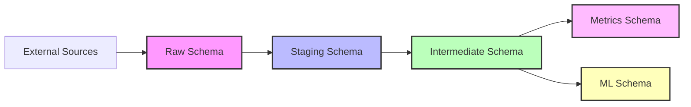
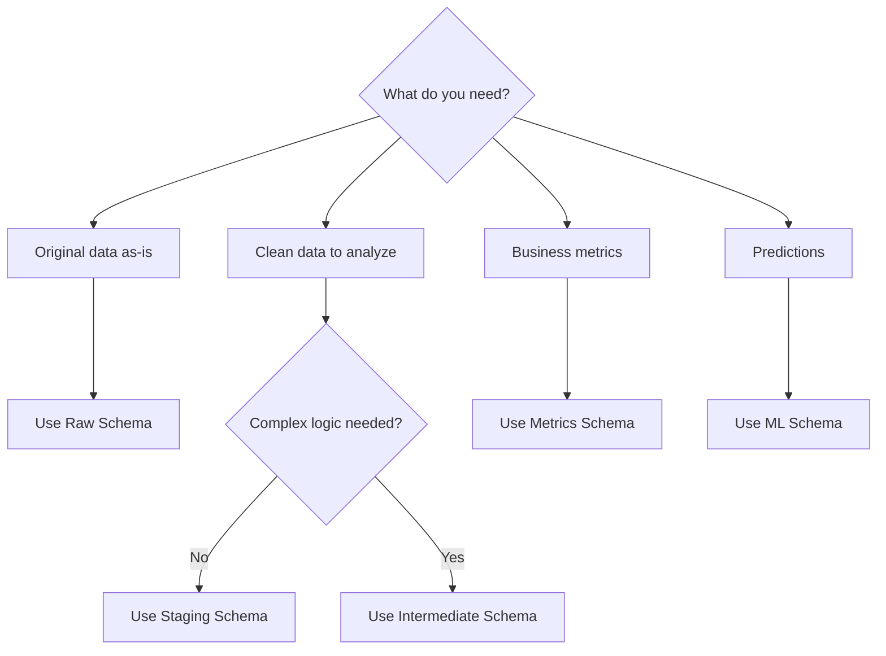

[🏠 Home](../../../) > [📚 Technical Docs](../../) > [📊 Data Catalog](../) > 📁 Schemas

# 📁 Database Schemas

Understanding the layered architecture of TapFlow Analytics data warehouse.

**Last Updated:** 2024-12-16 | **Est. Reading Time:** 10 min | **Difficulty:** Intermediate

## 🎯 Schema Overview

Our data warehouse follows a medallion architecture with clear separation of concerns:



## 📂 Schema Documentation

### [🔴 Raw Schema](./raw.md)
**Purpose:** Exact copies of source system data

**Characteristics:**
- No transformations applied
- Preserves original data types
- Includes all source columns
- Historical data retained
- Naming: `raw.*`

**Example Tables:**
- `raw.app_database_accounts`
- `raw.app_database_subscriptions`
- `raw.ga_session_analytics`

**Use When:** Debugging, auditing, or accessing untransformed data

---

### [🔵 Staging Schema](./staging.md)
**Purpose:** Cleaned and standardized data

**Characteristics:**
- Data type corrections
- Naming standardization
- Basic cleaning (trimming, null handling)
- No business logic
- Naming: `staging.stg_*`

**Example Tables:**
- `staging.stg_accounts`
- `staging.stg_subscriptions`
- `staging.stg_devices`

**Use When:** Starting point for analysis with clean data

---

### [🟢 Intermediate Schema](./intermediate.md)
**Purpose:** Business logic and enrichment applied

**Characteristics:**
- Calculated fields
- Business rules applied
- Joins and denormalization
- Derived attributes
- Naming: `intermediate.int_*`

**Example Tables:**
- `intermediate.int_customer_metrics`
- `intermediate.int_device_telemetry`
- `intermediate.int_revenue_details`

**Use When:** Analysis requiring business context

---

### [🟣 Metrics Schema](./metrics.md)
**Purpose:** Pre-aggregated business metrics

**Characteristics:**
- Ready-to-use KPIs
- Time-series aggregations
- Optimized for dashboards
- Slowly changing dimensions
- Naming: `metrics.*`

**Example Tables:**
- `metrics.daily_revenue`
- `metrics.customer_health_scores`
- `metrics.device_performance`

**Use When:** Building dashboards and reports

---

### [🟡 ML Schema](./ml.md)
**Purpose:** Machine learning features and predictions

**Characteristics:**
- Feature engineering
- Model predictions
- Training datasets
- Scoring results
- Naming: `ml.*`

**Example Tables:**
- `ml.churn_predictions`
- `ml.usage_features`
- `ml.anomaly_scores`

**Use When:** Advanced analytics and predictions

## 🔄 Data Flow Example

Let's trace how subscription data flows through schemas:

```sql
-- 1. Raw: Exact copy from source
SELECT * FROM raw.app_database_subscriptions;
-- Contains: all original columns, original types

-- 2. Staging: Cleaned and typed
SELECT * FROM staging.stg_subscriptions;
-- Contains: standardized names, correct types, trimmed strings

-- 3. Intermediate: Business logic applied
SELECT * FROM intermediate.int_subscription_facts;
-- Contains: calculated MRR, tenure, status flags

-- 4. Metrics: Aggregated for reporting
SELECT * FROM metrics.daily_mrr;
-- Contains: pre-calculated daily/monthly MRR by segment
```

## 📊 Schema Statistics

| Schema | Purpose | Table Count | Update Frequency | Primary Users |
|--------|---------|-------------|------------------|---------------|
| raw | Source data | 285 | Real-time | Engineers |
| staging | Clean data | 95 | Every 15 min | Analysts |
| intermediate | Business logic | 45 | Hourly | Analysts |
| metrics | Aggregations | 20 | Daily | Business Users |
| ml | Predictions | 5 | Daily | Data Scientists |

## 🚦 Best Practices by Schema

### Raw Schema
- ❌ Never modify raw tables
- ✅ Use for data lineage
- ✅ Reference for debugging

### Staging Schema
- ✅ Start analysis here
- ✅ Join with other staging tables
- ❌ Avoid complex calculations

### Intermediate Schema
- ✅ Primary analysis layer
- ✅ Contains business logic
- ✅ Well-documented transforms

### Metrics Schema
- ✅ Dashboard ready
- ✅ Pre-tested calculations
- ❌ Don't re-aggregate

### ML Schema
- ✅ Use predictions confidently
- ✅ Check model metadata
- ⚠️ Understand confidence scores

## 🔍 Finding the Right Schema



## 🛠️ Working with Schemas

### Querying Across Schemas
```sql
-- Good: Use appropriate schema for each need
SELECT 
    s.customer_id,
    s.plan_name,
    m.health_score,
    p.churn_probability
FROM staging.stg_subscriptions s
JOIN metrics.customer_health_scores m ON s.customer_id = m.customer_id
JOIN ml.churn_predictions p ON s.customer_id = p.customer_id
WHERE s.status = 'active';
```

### Schema Permissions
- **Read Access:** All analysts have read access to all schemas
- **Write Access:** Limited to ETL processes and admins
- **Create Access:** DBAs and data engineers only

## 📈 Schema Evolution

Schemas evolve based on business needs:

1. **New Sources** → New raw tables
2. **New Requirements** → New intermediate logic
3. **New KPIs** → New metrics tables
4. **New Models** → New ML tables

Changes are tracked in:
- [Schema changelog](../../schema_changelog.md)
- dbt model documentation
- Git commit history

---

<div class="nav-footer">

[← Data Catalog](../) | [Raw Schema →](./raw.md)

</div>

**Questions?** See [data modeling guide](../../data_model_documentation.md) or [FAQ](../../../edu/resources/faq.md)