# Entity Relationship Diagram

## Core Entity Relationships (Mermaid ERD)

```mermaid
erDiagram
    %% Core Business Entities
    ACCOUNTS {
        uuid account_id PK
        varchar account_name
        varchar account_type
        varchar industry_vertical
        varchar status
        varchar billing_email
        integer total_locations
        integer employee_count
        varchar headquarters_city
        varchar headquarters_state
        varchar headquarters_country
        timestamp created_at
        timestamp updated_at
    }
    
    LOCATIONS {
        uuid location_id PK
        uuid account_id FK
        varchar location_name
        varchar location_type
        text address
        varchar city
        varchar state
        varchar country
        varchar postal_code
        decimal latitude
        decimal longitude
        varchar timezone
        jsonb business_hours
        integer seating_capacity
        integer total_taps
        integer active_device_count
        varchar status
        timestamp created_at
        date opened_date
        date closed_date
        timestamp updated_at
    }
    
    USERS {
        uuid user_id PK
        uuid account_id FK
        uuid location_id FK
        varchar email
        varchar first_name
        varchar last_name
        varchar role_type
        varchar status
        timestamp created_at
        timestamp last_login_at
        timestamp updated_at
    }
    
    DEVICES {
        uuid device_id PK
        uuid location_id FK
        uuid account_id FK
        varchar device_type
        varchar model_number
        varchar serial_number
        varchar firmware_version
        date installation_date
        varchar installer_name
        date last_maintenance_date
        date next_maintenance_due
        integer maintenance_interval_days
        varchar status
        timestamp last_heartbeat_at
        timestamp created_at
        timestamp updated_at
    }
    
    SUBSCRIPTIONS {
        uuid subscription_id PK
        uuid account_id FK
        varchar plan_type
        varchar plan_name
        varchar billing_cycle
        integer base_price_cents
        varchar status
        date trial_start_date
        date trial_end_date
        timestamp created_at
        timestamp started_at
        timestamp current_period_start
        timestamp current_period_end
        timestamp canceled_at
        timestamp ended_at
        timestamp updated_at
    }
    
    %% High-Volume Fact Tables
    TAP_EVENTS {
        uuid tap_event_id PK
        uuid device_id FK
        uuid location_id FK
        uuid account_id FK
        timestamp event_timestamp
        varchar event_type
        decimal flow_rate_ml_per_sec
        decimal total_volume_ml
        decimal temperature_celsius
        decimal pressure_psi
        varchar beverage_type
        integer tap_number
        timestamp created_at
    }
    
    USER_SESSIONS {
        uuid session_id PK
        uuid user_id FK
        uuid account_id FK
        timestamp session_start
        timestamp session_end
        varchar device_type
        varchar operating_system
        varchar browser
        varchar browser_version
        inet ip_address
        text user_agent
        varchar country_code
        varchar region
        varchar city
        timestamp created_at
    }
    
    PAGE_VIEWS {
        uuid page_view_id PK
        uuid session_id FK
        uuid user_id FK
        varchar page_path
        varchar page_title
        varchar page_category
        timestamp timestamp
        integer time_on_page_seconds
        text referrer_url
        varchar referrer_domain
        timestamp created_at
    }
    
    FEATURE_USAGE {
        uuid usage_id PK
        uuid user_id FK
        uuid account_id FK
        varchar feature_name
        varchar feature_category
        varchar feature_version
        timestamp usage_timestamp
        integer usage_duration_seconds
        boolean success_indicator
        jsonb context_data
        text error_message
        timestamp created_at
    }
    
    %% Stripe Payment Integration
    STRIPE_CUSTOMERS {
        varchar id PK
        varchar email
        varchar name
        text description
        varchar currency
        varchar default_source
        integer account_balance
        boolean delinquent
        jsonb shipping
        jsonb metadata
        integer created
        integer updated
    }
    
    STRIPE_SUBSCRIPTIONS {
        varchar id PK
        varchar customer FK
        varchar status
        integer billing_cycle_anchor
        boolean cancel_at_period_end
        varchar collection_method
        integer current_period_start
        integer current_period_end
        integer canceled_at
        integer cancel_at
        jsonb cancellation_details
        integer trial_start
        integer trial_end
        jsonb metadata
        integer created
        integer start_date
        integer ended_at
    }
    
    STRIPE_INVOICES {
        varchar id PK
        varchar customer FK
        varchar subscription FK
        varchar invoice_number
        varchar status
        varchar billing_reason
        varchar collection_method
        integer amount_due
        integer amount_paid
        integer amount_remaining
        integer subtotal
        integer total
        integer tax
        varchar currency
        integer attempt_count
        varchar payment_intent
        varchar charge
        integer period_start
        integer period_end
        integer due_date
        jsonb status_transitions
        boolean auto_advance
        boolean paid
        boolean forgiven
        boolean attempted
        jsonb metadata
        integer created
    }
    
    STRIPE_CHARGES {
        varchar id PK
        varchar customer FK
        varchar invoice FK
        varchar payment_intent
        integer amount
        integer amount_captured
        integer amount_refunded
        integer application_fee_amount
        varchar currency
        varchar status
        boolean paid
        boolean refunded
        boolean captured
        boolean disputed
        jsonb payment_method_details
        jsonb outcome
        varchar failure_code
        text failure_message
        jsonb billing_details
        varchar balance_transaction
        text receipt_url
        jsonb metadata
        integer created
    }
    
    %% Marketing Entities
    MARKETING_QUALIFIED_LEADS {
        uuid lead_id PK
        varchar email
        varchar first_name
        varchar last_name
        varchar company_name
        varchar job_title
        varchar phone
        varchar lead_source
        integer lead_score
        varchar qualification_status
        varchar utm_source
        varchar utm_medium
        varchar utm_campaign
        text form_submission_url
        timestamp created_at
        timestamp qualified_at
        timestamp converted_at
        timestamp updated_at
    }
    
    ATTRIBUTION_TOUCHPOINTS {
        uuid touchpoint_id PK
        uuid user_id FK
        uuid account_id FK
        uuid session_id FK
        timestamp touchpoint_timestamp
        varchar touchpoint_type
        varchar channel
        varchar campaign_id
        varchar campaign_name
        varchar ad_group_id
        varchar ad_group_name
        varchar keyword
        varchar utm_source
        varchar utm_medium
        varchar utm_campaign
        varchar utm_content
        varchar utm_term
        text referrer_url
        text landing_page_url
        decimal conversion_value
        decimal attribution_weight
        timestamp created_at
    }
    
    GOOGLE_ADS_CAMPAIGN_PERFORMANCE {
        varchar campaign_id PK
        date date PK
        varchar campaign_name
        varchar campaign_status
        varchar campaign_type
        bigint impressions
        bigint clicks
        bigint cost_micros
        decimal conversions
        bigint conversion_value
        varchar customer_id
        timestamp created_at
    }
    
    %% HubSpot CRM Integration
    HUBSPOT_COMPANIES {
        bigint id PK
        jsonb properties
        timestamp created_at
        timestamp updated_at
    }
    
    HUBSPOT_CONTACTS {
        bigint id PK
        jsonb properties
        timestamp created_at
        timestamp updated_at
    }
    
    HUBSPOT_DEALS {
        bigint id PK
        jsonb properties
        timestamp created_at
        timestamp updated_at
    }
    
    %% Email Marketing
    ITERABLE_EMAIL_EVENTS {
        varchar message_id PK
        varchar email PK
        varchar event_name PK
        timestamp created_at PK
        varchar campaign_id
        varchar template_id
        varchar user_id
        varchar campaign_name
        varchar campaign_type
        text subject_line
        varchar from_email
        varchar from_name
        text content_url
        text link_url
        text bounce_reason
        varchar unsub_source
        text user_agent
        inet ip_address
        varchar city
        varchar region
        varchar country_code
        jsonb custom_fields
    }
    
    %% Core Relationships
    ACCOUNTS ||--o{ LOCATIONS : "has many"
    ACCOUNTS ||--o{ USERS : "has many"
    ACCOUNTS ||--o{ SUBSCRIPTIONS : "has many"
    ACCOUNTS ||--o{ DEVICES : "has many"
    ACCOUNTS ||--o{ TAP_EVENTS : "generates"
    ACCOUNTS ||--o{ USER_SESSIONS : "generates"
    ACCOUNTS ||--o{ FEATURE_USAGE : "generates"
    ACCOUNTS ||--o{ ATTRIBUTION_TOUCHPOINTS : "converts from"
    
    LOCATIONS ||--o{ DEVICES : "has many"
    LOCATIONS ||--o{ TAP_EVENTS : "generates"
    LOCATIONS ||--o{ USERS : "may have"
    
    USERS ||--o{ USER_SESSIONS : "creates"
    USERS ||--o{ FEATURE_USAGE : "generates"
    USERS ||--o{ ATTRIBUTION_TOUCHPOINTS : "attributed from"
    
    DEVICES ||--o{ TAP_EVENTS : "generates"
    
    USER_SESSIONS ||--o{ PAGE_VIEWS : "contains"
    USER_SESSIONS ||--o{ ATTRIBUTION_TOUCHPOINTS : "may contain"
    
    %% Stripe Integration Relationships
    STRIPE_CUSTOMERS ||--o{ STRIPE_SUBSCRIPTIONS : "has"
    STRIPE_CUSTOMERS ||--o{ STRIPE_INVOICES : "billed to"
    STRIPE_CUSTOMERS ||--o{ STRIPE_CHARGES : "charged to"
    STRIPE_SUBSCRIPTIONS ||--o{ STRIPE_INVOICES : "generates"
    STRIPE_INVOICES ||--o{ STRIPE_CHARGES : "may have"
    
    %% Marketing Relationships
    MARKETING_QUALIFIED_LEADS ||--o{ ATTRIBUTION_TOUCHPOINTS : "may convert to"
```

## Key Relationship Patterns

### 1. **Hierarchical Structure**
- **Account** → **Location** → **Device** → **Tap Events**
- Each level maintains foreign key references to parent levels
- Supports both individual location analysis and account-level aggregation

### 2. **User Activity Flow**
- **User** → **User Session** → **Page Views** → **Feature Usage**
- Tracks complete user journey from authentication to feature interaction
- Enables cohort analysis and user engagement metrics

### 3. **Billing Integration**
- **Account** ↔ **Subscription** ↔ **Stripe Customer** ↔ **Stripe Subscription**
- Dual-system approach: internal subscription management + external payment processing
- Enables reconciliation between internal billing logic and payment provider

### 4. **Marketing Attribution Chain**
- **Campaign Performance** → **Attribution Touchpoints** → **User Sessions** → **Account Conversion**
- Multi-touch attribution model supporting various marketing channels
- Links campaign spend to customer acquisition and revenue

### 5. **IoT Data Hierarchy**
- **Device** → **Tap Events** (1:Many, high volume)
- Device metadata supports operational analytics
- Event data enables real-time monitoring and historical analysis

## Dimensional Modeling Implications

### Star Schema Centers:
1. **Revenue Analysis**: Subscription facts with Account, Time, Plan dimensions
2. **Product Usage**: Feature Usage facts with User, Account, Feature, Time dimensions  
3. **Marketing Performance**: Campaign Performance facts with Campaign, Channel, Time dimensions
4. **Operational Analytics**: Tap Events facts with Device, Location, Account, Time dimensions

### Slowly Changing Dimensions:
- **Account**: Type 2 for status/tier changes (revenue impact)
- **User**: Type 2 for role changes (security audit)
- **Subscription**: Type 2 for plan changes (pricing analysis)
- **Device**: Type 1 for status updates (operational focus)

### Bridge Tables:
- **Attribution Touchpoints**: Links marketing activities to user conversions
- **Stripe Integration**: Bridges internal business logic with external payment data
- **HubSpot Integration**: Connects CRM activities with platform usage

