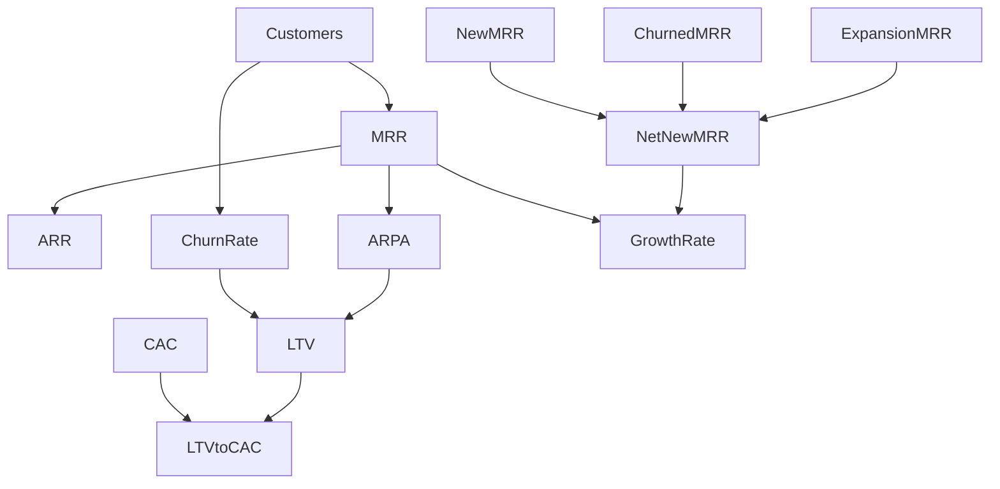

[🏠 Home](../../) > [📚 Technical Docs](../) > 📈 Metrics Catalog

# 📈 Metrics Catalog

Comprehensive guide to all business metrics and KPIs in TapFlow Analytics.

**Last Updated:** 2024-12-16 | **Est. Reading Time:** 20 min | **Difficulty:** Intermediate

## 🎯 Overview

The Metrics Catalog documents 50+ key business metrics with:
- 📝 Clear business definitions
- 🧮 SQL calculation logic
- 📊 Current values and trends
- 🔗 Data lineage and dependencies
- 💡 Usage examples and best practices

## 📂 Metric Categories

### [💰 Revenue Metrics](./revenue_metrics.md)
Core financial metrics for subscription business model.

**Key Metrics:**
- **MRR** (Monthly Recurring Revenue) - Total recurring revenue
- **ARR** (Annual Recurring Revenue) - Annualized MRR
- **ARPA** (Average Revenue Per Account) - Revenue efficiency
- **LTV** (Customer Lifetime Value) - Total customer value
- **CAC** (Customer Acquisition Cost) - Cost to acquire
- **NRR** (Net Revenue Retention) - Revenue expansion

**Use When:** Financial reporting, investor updates, revenue forecasting

---

### [⚙️ Operational Metrics](./operational_metrics.md)
Platform performance and reliability indicators.

**Key Metrics:**
- **Device Uptime** - Percentage of devices online
- **API Response Time** - Service performance
- **Error Rate** - System reliability
- **Throughput** - Transaction volume
- **SLA Compliance** - Service level achievement
- **MTTR** (Mean Time To Resolve) - Incident resolution

**Use When:** System monitoring, performance optimization, SLA reporting

---

### [👥 Customer Metrics](./customer_metrics.md)
Customer behavior and satisfaction measurements.

**Key Metrics:**
- **Customer Count** - Total and active customers
- **Churn Rate** - Customer cancellation rate
- **NPS** (Net Promoter Score) - Satisfaction metric
- **Health Score** - Composite engagement metric
- **Support Tickets** - Customer issue volume
- **Feature Adoption** - Product usage depth

**Use When:** Customer success, retention strategies, product planning

---

### [📱 Product Metrics](./product_metrics.md)
Product usage and engagement analytics.

**Key Metrics:**
- **DAU/MAU** (Daily/Monthly Active Users) - Engagement
- **Feature Adoption Rate** - New feature success
- **Session Duration** - User engagement depth
- **Retention Curves** - User stickiness
- **Activation Rate** - Onboarding success
- **Core Action Frequency** - Key behavior tracking

**Use When:** Product development, feature prioritization, UX optimization

---

### [📣 Marketing Metrics](./marketing_metrics.md)
Campaign performance and growth measurements.

**Key Metrics:**
- **Lead Generation** - Top of funnel volume
- **Conversion Rate** - Funnel efficiency
- **CAC by Channel** - Channel effectiveness
- **Marketing ROI** - Return on spend
- **Attribution** - Multi-touch credit
- **Brand Awareness** - Market presence

**Use When:** Campaign optimization, budget allocation, growth planning

---

### [💼 Sales Metrics](./sales_metrics.md)
Sales performance and pipeline health.

**Key Metrics:**
- **Pipeline Value** - Total opportunity value
- **Win Rate** - Deal success rate
- **Sales Velocity** - Pipeline speed
- **ACV** (Annual Contract Value) - Deal size
- **Quota Attainment** - Rep performance
- **Pipeline Coverage** - Forecast confidence

**Use When:** Sales forecasting, territory planning, comp calculations

## 🔍 Quick Metric Finder

### By Business Question

**"How much revenue do we have?"**
- [MRR](./revenue_metrics.md#mrr) - Current monthly revenue
- [ARR](./revenue_metrics.md#arr) - Annualized revenue
- [Revenue by Segment](./revenue_metrics.md#segmentation)

**"Are we growing?"**
- [MRR Growth Rate](./revenue_metrics.md#growth-rate)
- [Net New MRR](./revenue_metrics.md#net-new)
- [Customer Growth](./customer_metrics.md#growth)

**"Are customers happy?"**
- [NPS Score](./customer_metrics.md#nps)
- [Churn Rate](./customer_metrics.md#churn)
- [Health Score](./customer_metrics.md#health)

**"Is the platform reliable?"**
- [Uptime](./operational_metrics.md#uptime)
- [Error Rate](./operational_metrics.md#errors)
- [Response Time](./operational_metrics.md#performance)

**"Are we efficient?"**
- [CAC Payback](./revenue_metrics.md#cac-payback)
- [LTV:CAC Ratio](./revenue_metrics.md#ltv-cac)
- [Gross Margin](./revenue_metrics.md#margins)

## 📊 Metric Standards

### Definition Template
Every metric follows this structure:
```
## Metric Name

### Definition
Clear business definition in plain language

### Formula
Mathematical or logical calculation

### SQL Implementation
SELECT statement with comments

### Data Sources
- Primary tables used
- Update frequency
- Data quality considerations

### Current Value
- Latest calculated value
- Trend (↑ ↓ →)
- Target/benchmark

### Segmentation
- Common breakdowns
- Filtering options
- Cohort analysis

### Related Metrics
- Upstream dependencies
- Downstream impacts
- Similar metrics
```

### Calculation Standards

#### Time Periods
- **Daily**: Midnight to midnight UTC
- **Weekly**: Monday to Sunday
- **Monthly**: Calendar month
- **Quarterly**: Calendar quarter
- **Annual**: Calendar year

#### Growth Calculations
- **MoM**: (Current Month / Previous Month) - 1
- **YoY**: (Current Year / Previous Year) - 1
- **CMGR**: (Ending / Beginning)^(1/Months) - 1

#### Aggregation Rules
- **Revenue**: Sum of recognized amounts
- **Counts**: Distinct unless specified
- **Rates**: Percentage with 2 decimal places
- **Money**: USD with appropriate precision

## 🛠️ Using Metrics

### Best Practices

1. **Understand the Definition**
   - Read the business context
   - Check calculation logic
   - Note any caveats

2. **Check Data Freshness**
   - Review update frequency
   - Verify last refresh time
   - Consider data lag

3. **Apply Proper Filters**
   - Exclude test accounts
   - Use appropriate date ranges
   - Apply business rules

4. **Validate Results**
   - Cross-check with other metrics
   - Verify reasonableness
   - Test edge cases

### Common Pitfalls

❌ **Don't:**
- Mix time zones
- Double-count revenues
- Ignore seasonality
- Forget cohort effects

✅ **Do:**
- Use consistent definitions
- Document assumptions
- Version control changes
- Validate with stakeholders

## 📈 Metric Relationships



## 🔄 Metric Governance

### Change Process
1. **Propose** - Submit metric change request
2. **Review** - Analytics team validation
3. **Test** - Parallel calculation period
4. **Communicate** - Stakeholder notification
5. **Deploy** - Update documentation and code

### Version History
All metric changes are tracked:
- Git history for SQL changes
- Documentation changelog
- Audit trail in database

### Quality Assurance
- Automated testing of calculations
- Anomaly detection on values
- Regular stakeholder review
- Cross-functional validation

---

<div class="nav-footer">

[← Technical Docs](../) | [Revenue Metrics →](./revenue_metrics.md)

</div>

**Need help?** Check [calculation examples](./calculation_examples.md) or [FAQ](../../edu/resources/faq.md)