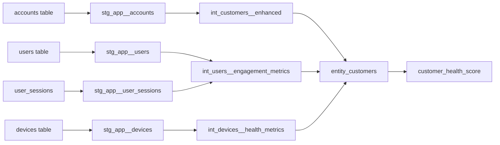
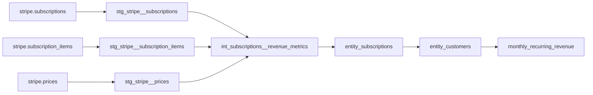
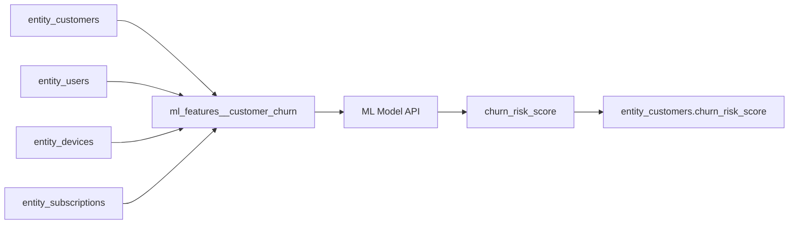
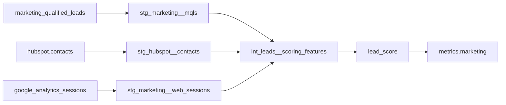
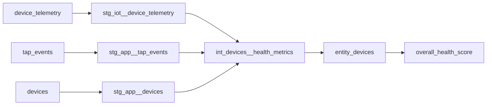
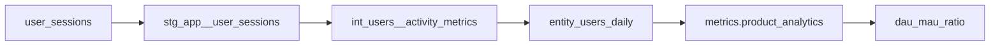
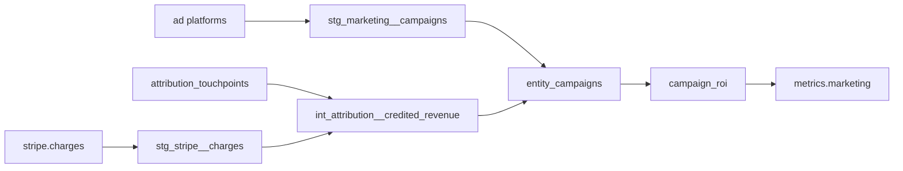
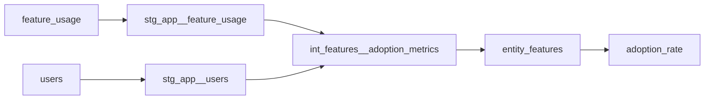

# Metric Lineage Documentation

This document traces the complete lineage of all key metrics in the SaaS Analytics Platform, showing how raw data transforms into business metrics.

## 🔄 Lineage Overview

```
Raw Sources → Staging → Intermediate → Entity → Metrics
```

---

## 📊 Customer Health Score

### Definition
Composite score (0-100) indicating overall customer health based on multiple factors.

### Lineage Path


### Calculation Logic
```sql
-- Location: models/entity/entity_customers.sql
customer_health_score = (
    user_engagement_factor * 0.3 +      -- From int_users__engagement_metrics
    device_health_factor * 0.2 +        -- From int_devices__health_metrics  
    revenue_growth_factor * 0.2 +       -- From int_subscriptions__revenue_metrics
    support_satisfaction_factor * 0.15 + -- From int_support__satisfaction_metrics
    feature_adoption_factor * 0.15       -- From int_features__adoption_metrics
)

-- Factors normalized to 0-100 scale
```

### Dependencies
- `stg_app__accounts`: Customer master data
- `int_users__engagement_metrics`: User activity scores
- `int_devices__health_metrics`: Device uptime and performance
- `int_subscriptions__revenue_metrics`: Revenue trends
- `int_support__satisfaction_metrics`: Support interactions
- `int_features__adoption_metrics`: Feature usage

---

## 💰 Monthly Recurring Revenue (MRR)

### Definition
Total recurring revenue normalized to monthly basis.

### Lineage Path


### Calculation Logic
```sql
-- Location: models/intermediate/subscriptions/int_subscriptions__revenue_metrics.sql
monthly_recurring_revenue = 
    CASE 
        WHEN billing_period = 'month' THEN amount
        WHEN billing_period = 'year' THEN amount / 12
        WHEN billing_period = 'quarter' THEN amount / 3
        ELSE 0
    END

-- Aggregated at customer level in entity_customers
```

### Dependencies
- `stg_stripe__subscriptions`: Active subscriptions
- `stg_stripe__subscription_items`: Line items
- `stg_stripe__prices`: Pricing details

---

## 📈 Churn Risk Score

### Definition
Probability score (0-100) of customer churning in next 90 days.

### Lineage Path


### Calculation Logic
```python
# Location: ml/models/churn_prediction.py
features = [
    'days_since_last_login',        # From entity_users
    'user_engagement_decline_30d',   # From entity_users_daily
    'device_health_decline_30d',     # From entity_devices_hourly
    'support_tickets_increase_30d',  # From int_support__metrics
    'feature_usage_decline_30d',     # From entity_features
    'payment_failures_90d',          # From stg_stripe__charges
    'contract_days_remaining',       # From entity_subscriptions
    'competitor_activity_score'      # From external data
]

churn_risk_score = model.predict_proba(features)[1] * 100
```

### Dependencies
- `entity_customers`: Current state
- `entity_users`: Engagement metrics
- `entity_devices`: Device health
- `entity_subscriptions`: Contract details
- ML Model: Trained on historical churn data

---

## 🎯 Lead Scoring

### Definition
Quality score (0-100) for marketing qualified leads.

### Lineage Path


### Calculation Logic
```sql
-- Location: models/intermediate/marketing/int_leads__scoring_features.sql
lead_score = (
    demographic_score * 0.3 +        -- Company size, industry fit
    behavioral_score * 0.4 +         -- Web activity, content engagement
    engagement_score * 0.2 +         -- Email opens, clicks
    intent_score * 0.1               -- Third-party intent data
)

-- Demographic Score Components
company_size_score = CASE 
    WHEN employee_count > 500 THEN 100
    WHEN employee_count > 100 THEN 70
    ELSE 40
END

-- Behavioral Score Components  
page_views_score = LEAST(page_views_30d * 5, 100)
content_downloads_score = LEAST(downloads * 20, 100)
```

### Dependencies
- `stg_marketing__mqls`: Lead data
- `stg_hubspot__contacts`: CRM enrichment
- `stg_marketing__web_sessions`: Behavioral data
- External intent data providers

---

## 🔧 Device Health Score

### Definition
Overall health indicator (0-100) for IoT tap devices.

### Lineage Path


### Calculation Logic
```sql
-- Location: models/intermediate/devices/int_devices__health_metrics.sql
overall_health_score = (
    uptime_score * 0.4 +            -- Uptime percentage
    performance_score * 0.3 +        -- Response time, error rate
    maintenance_score * 0.2 +        -- Days since maintenance
    usage_pattern_score * 0.1        -- Anomaly detection
)

-- Uptime Score
uptime_score = uptime_percentage_30d

-- Performance Score  
performance_score = 100 - (error_rate_7d * 10)

-- Maintenance Score
maintenance_score = CASE
    WHEN days_since_maintenance > 90 THEN 0
    WHEN days_since_maintenance > 60 THEN 50
    ELSE 100
END
```

### Dependencies
- `stg_iot__device_telemetry`: Real-time metrics
- `stg_app__tap_events`: Usage events
- `stg_app__devices`: Device master data

---

## 📊 DAU/MAU Ratio (Stickiness)

### Definition
Daily Active Users divided by Monthly Active Users, indicating product stickiness.

### Lineage Path


### Calculation Logic
```sql
-- Location: models/metrics/product_analytics/metrics_product_analytics.sql
WITH user_activity AS (
    SELECT 
        COUNT(DISTINCT CASE WHEN last_login_date = CURRENT_DATE THEN user_id END) as dau,
        COUNT(DISTINCT CASE WHEN last_login_date >= CURRENT_DATE - 30 THEN user_id END) as mau
    FROM entity_users
    WHERE user_status = 'active'
)
SELECT 
    dau,
    mau,
    CASE WHEN mau > 0 THEN ROUND(100.0 * dau / mau, 2) ELSE 0 END as dau_mau_ratio
FROM user_activity
```

### Dependencies
- `stg_app__user_sessions`: Session data
- `entity_users`: User state
- Date logic for activity windows

---

## 🎯 Campaign ROI

### Definition
Return on Investment for marketing campaigns.

### Lineage Path


### Calculation Logic
```sql
-- Location: models/entity/campaigns/entity_campaigns.sql
roi = (attributed_revenue - total_spend) / NULLIF(total_spend, 0) * 100

-- Attribution Model (Linear)
attributed_revenue = SUM(
    order_value * (1.0 / touchpoint_count)
) 
WHERE touchpoint_timestamp <= conversion_timestamp
  AND touchpoint_timestamp >= conversion_timestamp - INTERVAL '30 days'
```

### Dependencies
- `stg_marketing__campaigns`: Spend data
- `int_attribution__credited_revenue`: Revenue attribution
- `stg_stripe__charges`: Payment data
- Attribution window configuration

---

## 🚀 Feature Adoption Rate

### Definition
Percentage of users actively using a specific feature.

### Lineage Path


### Calculation Logic
```sql
-- Location: models/intermediate/features/int_features__adoption_metrics.sql
adoption_rate = active_users_30d / NULLIF(total_eligible_users, 0)

-- Active users defined as:
-- - Used feature at least once in last 30 days
-- - For core features: Used at least 3 times
-- - For advanced features: Any usage counts
```

### Dependencies
- `stg_app__feature_usage`: Usage events
- `stg_app__users`: User population
- Feature configuration metadata

---

## 📈 Metrics Refresh Schedule

| Metric | Refresh Frequency | Update Method | SLA |
|--------|------------------|---------------|-----|
| Customer Health Score | Every 4 hours | Incremental | <5 min |
| MRR | Real-time | Event-driven | <1 min |
| Churn Risk Score | Daily | ML batch | <30 min |
| Lead Score | Hourly | Incremental | <5 min |
| Device Health | Every 15 min | Streaming | <2 min |
| DAU/MAU | Hourly | Incremental | <3 min |
| Campaign ROI | Every 6 hours | Full refresh | <10 min |
| Feature Adoption | Daily | Incremental | <5 min |

---

## 🔍 Tracing Metric Issues

### How to Debug Metric Discrepancies

1. **Check Source Data**
```sql
-- Verify source record counts
SELECT COUNT(*), MAX(updated_at) 
FROM source_table
WHERE updated_at >= CURRENT_DATE - 1;
```

2. **Validate Staging Layer**
```sql
-- Check staging transformations
SELECT * FROM stg_schema__table
WHERE record_id = 'problematic_id';
```

3. **Review Intermediate Logic**
```sql
-- Examine business logic
SELECT * FROM int_domain__metrics
WHERE customer_id = 'affected_customer';
```

4. **Verify Entity State**
```sql
-- Check entity tables
SELECT * FROM entity.entity_name
WHERE metric_value IS NULL OR metric_value < 0;
```

5. **Audit Metric Calculation**
```sql
-- Review final metric
SELECT 
    source_value,
    calculated_metric,
    calculation_timestamp
FROM metrics.domain
WHERE ABS(expected - actual) > threshold;
```

---

## 📚 Metric Governance

### Change Management Process

1. **Metric Definition Changes**
   - File PR with business justification
   - Update this lineage document
   - Run impact analysis
   - Notify stakeholders
   - Version in dbt with deprecation notice

2. **New Metric Addition**
   - Define business need
   - Document calculation logic
   - Create lineage diagram
   - Add to metric catalog
   - Implement monitoring

3. **Metric Deprecation**
   - 30-day notice period
   - Migration guide for users
   - Update downstream dependencies
   - Archive historical values
   - Remove from active dashboards

### Quality Assurance

All metrics must have:
- [ ] Clear business definition
- [ ] Documented lineage
- [ ] Data quality tests
- [ ] Performance benchmarks
- [ ] Stakeholder ownership